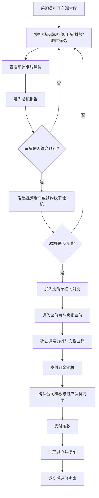
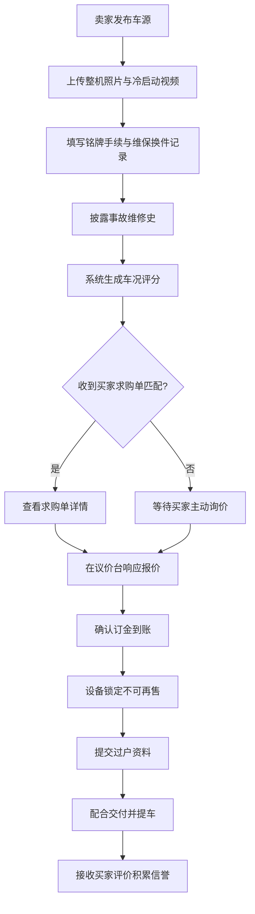

## 1. 产品概述

铁甲撮合（TieJia Match）是面向中小施工单位设备采购员的工程机械二手机交易撮合平台，覆盖挖机、装载机、压路机、吊车等主流机型。平台解决采购员跨区域看货难、车况不透明、议价无凭证、过户流程混乱等痛点，通过结构化的验机报告、智能车源推荐和留痕的议价台账，将传统的"人盯人"二手交易数字化为可追溯的撮合流程。
- 主要用户：中小施工企业设备采购员（买家）、二手机经销商/机主（卖家）
- 市场价值：降低采购员看货成本60%以上，缩短从询价到提车的决策周期，建立行业车况披露标准

## 2. 核心功能

### 2.1 用户角色

| 角色 | 注册方式 | 核心权限 |
|------|----------|----------|
| 采购员（买家） | 企业手机号注册 | 浏览车源、发布求购单、发起看车、议价、成交评价 |
| 经销商/机主（卖家） | 企业认证注册 | 发布车源、填写维保记录、响应议价、确认过户 |
| 平台撮合员 | 内部账号 | 审核车况、介入议价纠纷、生成合同模板 |

### 2.2 功能模块

1. **车源大厅**：多维度筛选矩阵、车源卡片瀑布流、智能推荐车源、一键看车/预约验机入口
2. **需求单**：求购单发布表单、预算与工期设置、车源匹配推荐、需求单状态跟踪
3. **验机报告**：整机照片墙、冷启动视频、铭牌与手续扫描件、维保与换件记录、事故维修史披露
4. **议价台**：多设备横向比价单、议价对话流、运费分摊计算、含税口径确认、订金锁机
5. **成交中心**：交易节点时间线、合同模板确认、过户资料清单、付款待办、成交评价

### 2.3 页面详情

| 页面名称 | 模块名称 | 功能描述 |
|----------|----------|----------|
| 车源大厅 | 筛选矩阵 | 按机型（挖机/装载机/压路机/吊车）、品牌、吨位区间、工况小时数、排放阶段（国三/国四/国五）、所在城市多维筛选，支持筛选条件保存为常用 |
| 车源大厅 | 车源卡片 | 展示设备主图、机型品牌吨位、工况小时、排放、城市、参考价、车况评分标签，悬浮查看详情 |
| 车源大厅 | 智能推荐 | 基于买家浏览历史和未关闭需求单，推荐匹配车源并标注匹配度百分比 |
| 车源大厅 | 快捷动作 | 一键发起视频看车（跳转议价台视频会话）、线下预约验机（选择日期时段） |
| 需求单 | 求购发布 | 填写机型、品牌偏好、吨位、预算区间、工期起止、进场地点、排放要求 |
| 需求单 | 匹配推荐 | 系统按距离（进场地点到车源城市）、工况、预算三维度排序推荐车源，标注匹配理由 |
| 需求单 | 需求看板 | 展示已发布求购单状态（报价中/已匹配/已关闭）、收到的卖家报价数 |
| 验机报告 | 资料档案 | 整机照片（外观6面+驾驶室+发动机舱）、冷启动视频、铭牌特写、登记证/行驶证扫描件 |
| 验机报告 | 维保记录 | 卖家填写定期保养记录、最近三次换油时间、主要换件清单（部件/品牌/更换时间/工时） |
| 验机报告 | 事故披露 | 事故维修史、结构件修复记录、泡水/火烧披露声明 |
| 验机报告 | 车况评分 | 系统综合发动机、液压、底盘、外观四维度生成车况评分（A/B/C/D） |
| 议价台 | 比价单 | 选中多台设备生成横向比价表，对比吨位、工况、价格、运费、距离、车况评分 |
| 议价台 | 议价对话 | 买卖双方文字议价流，支持发送图片/语音，每轮报价自动记录时间戳和金额 |
| 议价台 | 费用计算 | 运费分摊计算器（含运费/不含运费）、含税/不含税口径切换、订金金额与锁机期限 |
| 议价台 | 订金锁机 | 买家支付订金锁定该设备，展示锁机剩余时长，卖家不可再售 |
| 成交中心 | 交易时间线 | 展示节点：验机通过→订金支付→合同签署→尾款待办→过户办理→提车完成，每个节点带时间戳和操作人 |
| 成交中心 | 合同模板 | 生成标准化二手设备买卖合同，支持在线逐条确认、补充特殊条款 |
| 成交中心 | 过户清单 | 展示过户所需资料清单（登记证/行驶证/购机发票/合格证/双方证件），勾选已备齐项 |
| 成交中心 | 成交评价 | 三维度评价：卖家响应速度、车况一致度、交付时效，1-5星打分+文字评价 |
| 成交中心 | 历史成交 | 查看历史成交记录、复购引导、卖家信誉积分展示 |

## 3. 核心流程

### 3.1 买家找车到成交主流程

采购员进入车源大厅筛选设备 → 查看验机报告确认车况 → 发起视频看车或预约线下验机 → 将心仪设备加入比价单 → 在议价台与卖家议价并确认费用口径 → 支付订金锁机 → 确认合同模板与过户资料 → 完成尾款支付与提车 → 成交后评价卖家。

### 3.2 卖家发布与撮合流程

卖家发布车源并填写完整验机资料 → 系统生成车况评分 → 收到买家求购单匹配推送 → 在议价台响应报价 → 确认订金到账锁机 → 配合过户资料提交 → 完成交付并接收评价。

## 4. 用户界面设计

### 4.1 设计风格

- **美学方向**：工业实用主义（Industrial Utilitarian）。灵感来自工程机械驾驶室仪表盘、安全警示标识、技术蓝图与钢制铭牌。界面应传递"可靠、专业、硬核"的工业质感，区别于消费级电商的柔美化设计。
- **主色调**：
  - 主色：钢灰 `#2D3338`（沉稳工业感，用于导航栏与主背景）
  - 强调色：安全黄 `#F5A623`（警示与行动色，用于按钮与关键数据高亮）
  - 辅助色：深炭黑 `#15181B`（数据密度区背景）、工程橙 `#FF6B1A`（紧急/订金状态）
  - 中性色：混凝土灰 `#8B95A1`、锈白 `#E8E6E1`
- **按钮风格**：硬边角矩形（4px 圆角），带2px右侧底部偏移阴影模拟实体按键凸起，主要按钮安全黄底黑字
- **字体**：
  - 标题：`Oswald`（ condensed 工业感衬线，用于大标题与数据标签）
  - 正文：`JetBrains Mono`（等宽字体，用于设备参数与编码，强化技术档案感）
  - 中文正文：`Noto Sans SC`（清晰可读）
- **布局**：左侧固定导航栏 + 右侧数据网格，卡片式车源展示带技术铭牌边框，表格密集排列对比数据
- **图标**：线性图标，2px 描边，工业仪表风格，配合警示色三角与圆形状态徽章
- **装饰元素**：背景使用网格线纹理（模拟方格纸）、对角条纹警示带（状态条）、冲孔金属板质感

### 4.2 页面设计概览

| 页面名称 | 模块名称 | UI 元素 |
|----------|----------|---------|
| 车源大厅 | 顶部导航 | 钢灰底栏，安全黄Logo，等宽字体菜单项，右侧用户头像与企业认证标 |
| 车源大厅 | 筛选矩阵 | 左侧固定筛选面板，机型用图标按钮组，吨位/工时用双滑块，城市用可搜索下拉，筛选条件以标签形式横向展示 |
| 车源大厅 | 车源卡片 | 黑色边框卡片，左上机型图标，主图占顶部60%，下方参数以"铭牌"表格形式密集排列，右下车况评分大字母徽章 |
| 车源大厅 | 智能推荐条 | 顶部黄色警示带横向滚动，显示"匹配你的求购单 #DJ2024"推荐车源缩略图 |
| 需求单 | 求购发布表单 | 双栏布局，左侧表单字段分区（基础信息/预算工期/进场要求），右侧实时预览需求单卡片 |
| 需求单 | 匹配推荐 | 卡片列表，每张卡片左上角匹配度圆环图，下方匹配理由标签（距离近/工况优/预算内） |
| 需求单 | 需求看板 | 看板三列布局（报价中/已匹配/已关闭），卡片可拖拽，顶部统计数字大字显示 |
| 验机报告 | 资料档案 | 顶部Tab切换（照片/视频/铭牌/手续），照片墙网格4列，视频带播放封面与时长，铭牌放大查看 |
| 验机报告 | 维保记录 | 时间线竖向排列，每条记录带图标节点，换件清单表格化展示部件详情 |
| 验机报告 | 车况评分 | 右侧固定栏，四维度雷达图 + 总评分大字母徽章（A/B/C/D对应绿/黄/橙/红） |
| 议价台 | 比价单 | 顶部表格横向对比选中设备，表头固定，单元格高亮最优值（绿色）/最差值（红色） |
| 议价台 | 议价对话 | 左右分栏，左侧对话流气泡（买蓝卖黄），右侧费用计算器与订金锁机面板 |
| 议价台 | 订金锁机 | 独立面板，倒计时数字大字显示锁机剩余时长，进度条填充 |
| 成交中心 | 交易时间线 | 竖向时间线，节点带状态图标（完成绿勾/进行中黄转/待办灰圈），当前节点放大显示 |
| 成交中心 | 合同模板 | 文档预览区 + 右侧条款确认清单，逐条勾选，特殊条款输入框 |
| 成交中心 | 过户清单 | 检查清单形式，每项带资料图标、状态（已备齐绿/待提交黄），底部完成度百分比 |
| 成交中心 | 成交评价 | 三维度星级评分卡片，每维度带图标，文字评价输入框，历史评价折叠展示 |

### 4.3 响应式设计

- 桌面优先设计（1280px+ 完整体验），平板端（768-1280px）筛选面板可折叠为抽屉，移动端（<768px）导航栏转为底部Tab，表格转为卡片堆叠
- 触控优化：筛选滑块加大触控区域，卡片按钮间距增大至48px，视频看车按钮固定底部悬浮

### 4.4 3D 场景说明

本项目不涉及3D场景，以2D数据界面为主，强化信息密度与可读性。
