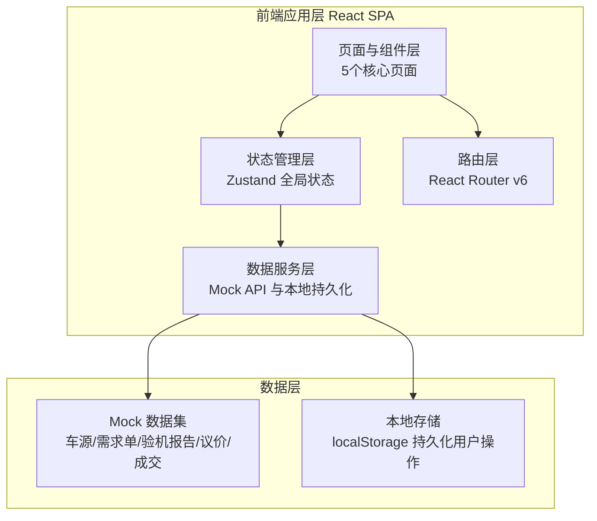

## 1. 架构设计

本项目采用纯前端单页应用架构，使用 Mock 数据模拟后端接口，便于快速演示完整的撮合业务流程。



## 2. 技术说明

- **前端框架**：React@18 + TypeScript
- **构建工具**：Vite@5
- **样式方案**：TailwindCSS@3（原子化CSS，配合CSS变量实现工业主题）
- **路由**：React Router v6（Hash 路由，适配静态部署）
- **状态管理**：Zustand（轻量全局状态，管理车源筛选、比价单、议价会话、交易节点）
- **数据可视化**：Recharts（车况雷达图、匹配度环图、统计图表）
- **图标库**：Lucide React（线性工业风图标）
- **字体加载**：Google Fonts（Oswald + JetBrains Mono + Noto Sans SC）
- **后端**：无（使用 Mock 数据模拟，数据存储于前端内存与 localStorage）
- **数据库**：无（Mock 数据集以 TypeScript 模块形式提供）

## 3. 路由定义

| 路由 | 页面名称 | 用途 |
|------|----------|------|
| `/hall` | 车源大厅 | 车源筛选、卡片浏览、智能推荐、发起看车 |
| `/demand` | 需求单 | 发布求购单、匹配推荐、需求看板 |
| `/inspection/:equipmentId` | 验机报告 | 查看指定设备的照片、视频、维保、事故史与评分 |
| `/bargain` | 议价台 | 横向比价单、议价对话、费用计算、订金锁机 |
| `/deal` | 成交中心 | 交易时间线、合同确认、过户清单、成交评价 |

全局布局包含左侧固定导航栏（5个页面入口 + 用户信息）与顶部状态栏。

## 4. API 定义（Mock 数据接口）

前端通过 Service 层封装的 Mock API 模拟后端请求，返回 Promise，数据来源为内置 TypeScript 数据集。

### 4.1 车源相关

```typescript
interface Equipment {
  id: string;
  type: 'excavator' | 'loader' | 'roller' | 'crane'; // 挖机/装载机/压路机/吊车
  typeLabel: string;
  brand: string;          // 品牌
  model: string;          // 型号
  tonnage: number;        // 吨位
  workHours: number;      // 工况小时
  emission: 'guo3' | 'guo4' | 'guo5'; // 排放阶段
  city: string;           // 所在城市
  price: number;          // 参考价（元）
  conditionScore: 'A' | 'B' | 'C' | 'D'; // 车况评分
  matchScore?: number;     // 匹配度（0-100）
  coverImage: string;      // 主图
  sellerId: string;
  status: 'available' | 'locked' | 'sold';
}

interface EquipmentFilter {
  type?: string;
  brand?: string;
  tonnageRange?: [number, number];
  workHoursRange?: [number, number];
  emission?: string;
  city?: string;
}

// Mock API
fetchEquipments(filter: EquipmentFilter): Promise<Equipment[]>
fetchEquipmentById(id: string): Promise<Equipment | undefined>
```

### 4.2 验机报告

```typescript
interface InspectionReport {
  equipmentId: string;
  photos: { category: string; url: string }[];     // 整机照片分类
  coldStartVideo: { url: string; duration: string; thumbnail: string };
  nameplate: { url: string; info: Record<string, string> }; // 铭牌
  documents: { type: string; url: string }[];       // 手续扫描件
  maintenanceRecords: { date: string; item: string; note: string }[];
  replacedParts: { part: string; brand: string; date: string; hours: number }[];
  accidentHistory: { date: string; description: string; repaired: boolean };
  scores: { engine: number; hydraulic: number; chassis: number; appearance: number };
  overallScore: 'A' | 'B' | 'C' | 'D';
}

fetchInspectionReport(equipmentId: string): Promise<InspectionReport>
```

### 4.3 需求单

```typescript
interface DemandOrder {
  id: string;
  type: string;
  brandPreference?: string;
  tonnage: number;
  budgetRange: [number, number];
  startDate: string;
  endDate: string;
  location: string;       // 进场地点
  emission?: string;
  status: 'quoting' | 'matched' | 'closed';
  receivedQuotes: number; // 收到报价数
  createdAt: string;
}

createDemandOrder(data: Omit<DemandOrder, 'id' | 'status' | 'receivedQuotes' | 'createdAt'>): Promise<DemandOrder>
fetchDemandOrders(): Promise<DemandOrder[]>
matchEquipmentsForDemand(demandId: string): Promise<{ equipment: Equipment; matchScore: number; reasons: string[] }[]>
```

### 4.4 议价与成交

```typescript
interface BargainSession {
  id: string;
  equipmentIds: string[];          // 参与比价的设备
  messages: { from: 'buyer' | 'seller'; content: string; timestamp: string; amount?: number }[];
  freightMode: 'included' | 'excluded'; // 运费分摊
  taxMode: 'taxIncluded' | 'taxExcluded'; // 含税口径
  depositAmount?: number;
  lockDeadline?: string;            // 锁机截止时间
}

interface DealRecord {
  id: string;
  equipmentId: string;
  timeline: { node: string; status: 'done' | 'current' | 'pending'; timestamp?: string; operator?: string }[];
  contractConfirmed: boolean;
  transferDocs: { name: string; ready: boolean }[];
  paymentTodo: { item: string; amount: number; paid: boolean };
  evaluation?: { responsiveness: number; conditionMatch: number; delivery: number; comment: string };
}

createBargainSession(equipmentIds: string[]): Promise<BargainSession>
sendMessage(sessionId: string, message: Partial<BargainMessage>): Promise<void>
lockEquipment(sessionId: string, deposit: number): Promise<void>
fetchDealRecords(): Promise<DealRecord[]>
submitEvaluation(dealId: string, evaluation: Evaluation): Promise<void>
```

## 5. 服务器架构说明

本项目为纯前端应用，不包含后端服务器。所有数据交互通过前端 Service 层模拟，使用内置 Mock 数据集与 localStorage 实现数据持久化与状态同步。

## 6. 数据模型

### 6.1 数据模型定义

```mermaid
erDiagram
    Equipment ||--|| InspectionReport : "拥有"
    Equipment }o--|| Seller : "属于"
    DemandOrder ||--o{ MatchResult : "匹配"
    MatchResult }o--|| Equipment : "指向"
    BargainSession }o--|{ Equipment : "包含"
    BargainSession ||--o{ BargainMessage : "记录"
    DealRecord ||--|| Equipment : "关联"
    DealRecord ||--o{ TimelineNode : "包含"
    DealRecord ||--o{ TransferDoc : "需要"
    DealRecord ||--o| Evaluation : "评价"

    Equipment {
        string id PK
        string type
        string brand
        number tonnage
        number workHours
        string emission
        string city
        number price
        string conditionScore
        string status
    }
    InspectionReport {
        string equipmentId PK_FK
        array photos
        object coldStartVideo
        object nameplate
        array documents
        array maintenanceRecords
        array replacedParts
        array accidentHistory
        object scores
        string overallScore
    }
    DemandOrder {
        string id PK
        string type
        number tonnage
        array budgetRange
        string location
        string status
    }
    BargainSession {
        string id PK
        array equipmentIds
        string freightMode
        string taxMode
        number depositAmount
        string lockDeadline
    }
    DealRecord {
        string id PK
        string equipmentId FK
        boolean contractConfirmed
    }
    Evaluation {
        string dealId PK_FK
        number responsiveness
        number conditionMatch
        number delivery
        string comment
    }
```

### 6.2 数据初始化

Mock 数据集以 TypeScript 模块形式内置，包含：
- 12台车源数据（覆盖4种机型、多个品牌与城市）
- 每台车源对应的完整验机报告
- 3条示例需求单及匹配结果
- 2条进行中的议价会话
- 2条历史成交记录及评价

数据在应用启动时加载至 Zustand Store，用户操作（如筛选、加比价单、发消息、锁机、评价）实时更新 Store 并同步至 localStorage，刷新页面后保持状态。
